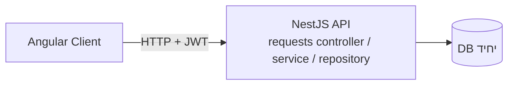
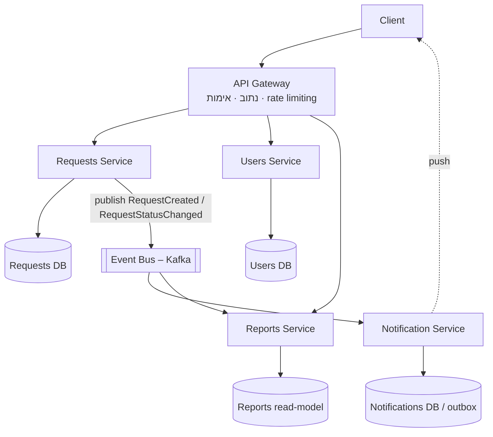
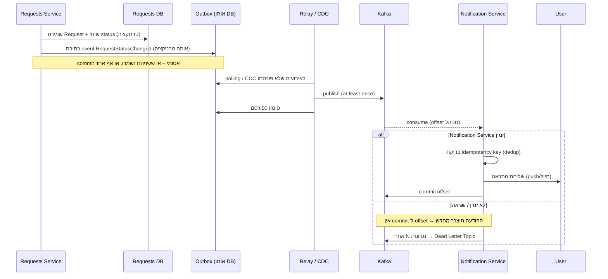

# חלק ב' – ארכיטקטורה ותכנון

## 1. מצב קיים

מונוליט מודולרי בסגנון Clean Architecture. הלקוח פונה ישירות ל-API,
וכל הלוגיקה (בקשות, הרשאות, בעתיד גם התראות ודוחות) רצה בתהליך אחד מול DB אחד.

| מאפיין | מצב קיים |
|--------|----------|
| פריסה | יחידה אחת – כל הלוגיקה באותו תהליך |
| בסיס נתונים | DB מרכזי יחיד |
| נקודת כניסה | הלקוח פונה ישירות ל-Controllers |
| תקשורת פנימית | קריאות in-process (הזרקת תלויות) |
| התראות / דוחות | סינכרוני, כחלק מאותו תהליך |
| סקיילביליות | הגדלת משאבים לכל המערכת יחד; שינוי קטן = deploy לכל ה-API |

---

## 2. חלוקה מוצעת ל-Microservices

| שירות | אחריות | מקור |
|-------|--------|------|
| **API Gateway** | נקודת כניסה יחידה, נתוב, אימות JWT, rate limiting, aggregation | חדש |
| **Requests Service** | CRUD + חיפוש/סינון/מיון/עימוד של פניות, אכיפת הרשאות | הקוד הקיים (`requests/`) הופך לליבה של השירות |
| **Users Service** | משתמשים, תפקידים, שיוך ובעלות | מופרד מה-DB הקיים |
| **Notification Service** | שליחת התראות למשתמש הרלוונטי, ניהול ערוצים (push/מייל/SMS), Hub | חדש |
| **Reports Service** | אגרגציות ודוחות מעל read-model נפרד | חדש |

**עקרונות:**

- **Database per Service** – לכל שירות DB משלו; אין join חוצה-שירותים. ניתוק ה-context
  הקיים מטבלאות שאינן קשורות ישירות לניהול הבקשות.
- **תקשורת א-סינכרונית מבוססת אירועים** בין Requests לבין Notification/Reports
  (Event Bus – Kafka/RabbitMQ). קריאות סינכרוניות (HTTP/gRPC) רק כשחייבים תשובה מיידית.
- ה-Gateway הוא הגבול היחיד שחשוף כלפי חוץ.

### תועלות

| תועלת | הסבר |
|-------|------|
| **סקיילינג נקודתי** | להגדיל משאבים רק לשירות העמוס (למשל Notification בשעות שיא) ולא לכל המערכת |
| **Deploy עצמאי** | שינוי ב-Reports לא דורש deploy של Requests; רדיוס נזק קטן |
| **בידוד תקלות** | Notification שנופל לא מפיל את חיפוש הפניות – האירועים מצטברים בתור |
| **בעלות ברורה** | צוות לכל שירות, גבולות API מוגדרים |
| **חופש טכנולוגי** | כל שירות בטכנולוגיה/DB שמתאים לו (למשל read-model ל-Reports) |

**מחיר (tradeoffs):** מורכבות תפעולית (orchestration, observability מבוזר),
עקביות eventual במקום מיידית, צורך ב-infra לתורים ולניטור. לא הייתי עובר לזה
לפני שהכאב של המונוליט מוחשי.

---

## 3. תרחיש – תקשורת אמינה לשליחת Notification

**דרישה:** כאשר Request נוצר או משנה Status, יש לשלוח Notification למשתמש הרלוונטי.
מערכת ה-Notification עלולה להיות זמנית לא זמינה – אסור לאבד הודעות.

**רכיבי המפתח לאמינות:**

1. **Transactional Outbox.** ה-Requests Service לא פונה ישירות ל-Notification. הוא כותב
   את האירוע לטבלת `outbox` *באותה טרנזקציית DB* של שינוי הפנייה. כך אין מצב שהפנייה
   השתנתה אבל האירוע אבד (או להפך).
2. **Relay / CDC.** תהליך רקע (או Debezium) קורא מה-outbox ומפרסם ל-Kafka, ומסמן
   כ-published. אם הפרסום נכשל – ינוסה שוב. → **at-least-once**.
3. **תור עמיד.** Kafka שומר את ההודעות עם retention; אם Notification Service למטה,
   ההודעות פשוט ממתינות – ה-consumer offset לא מתקדם. כשהשירות חוזר, הוא ממשיך
   בדיוק מהנקודה שבה עצר.
4. **Idempotency בצד הצרכן.** לכל אירוע `eventId` ייחודי. Notification Service שומר
   אילו eventIds כבר עובדו – משלוח כפול (תוצאה של at-least-once) לא גורם להתראה כפולה.
5. **ret + Backoff + DLQ.** כשל זמני (למשל ספק ה-push למטה) → ret עם exponential
   backoff. אחרי מספר נסיונות → Dead Letter Topic לטיפול ידני/מאוחר, בלי לחסום את שאר התור.
6. **Hub / חיבור ללקוח.** Notification Service מחזיק Hub (WebSocket/SSE). אם המשתמש
   לא מחובר – ההתראה נשמרת ותומצא בכניסה הבאה (pull), כך שגם צד הלקוח לא "מפספס".

**למה לא קריאת HTTP ישירה מ-Requests ל-Notification?** כי אז זמינות ה-Notification
הופכת לתלות קשיחה של פעולת שינוי הסטטוס: אם הוא למטה, או שהפעולה נכשלת, או שצריך
לוגיקת ret מסובכת בתוך ה-request. האירוע + התור מנתקים את הקשר.
